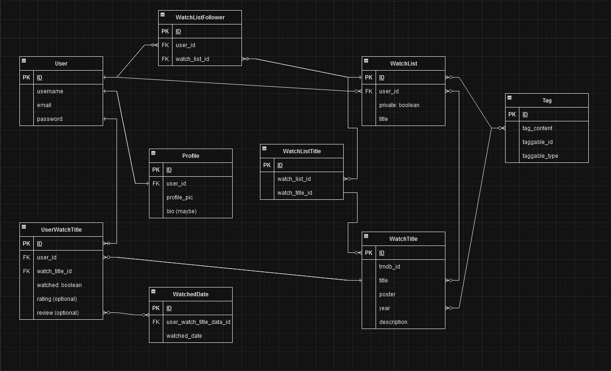

# Watchlist API

The watchlist API is the backend of my full stack project for CodeLabs. It is a database for users, as well as lists they create for content they have watched and want to watch. It is not comprehensive. The sole purpose is interfacing with themoviedb.org to get title data, save some of that data to a table in the API and for users to reference that data in their lists.

# Architecture

The main tables in the API are the **User**, the **WatchList** and WatchTitle**. There are join tables between these 3 to hold data that references each. For instance, the **WatchTitle** table holds basic title data requested from themoviedb.org. The **UserWatchTitle** table joins **User** and **WatchTitle** and holds data for the User such as whether the title is watched, the user's optional rating and the optional review.

# Gems Used

The API utilizes the following gems:
- **bcrypt**
- **jwt**
- **blueprinter**
- **rest-client**

# Testing

Testing was made possible by using the **rspec-rails** gem along with **factory_bot_rails** and **faker**.

# Frontend Client

The frontend client repository is located at: https://github.com/tsfento/watchlist-client

# ERD
